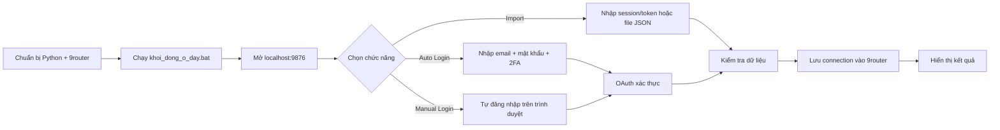

# Import 9router · 1 nút nhấn

> Công cụ local giúp đăng nhập OAuth Codex và nhập connection vào 9router.

## Pipeline tổng quát



## 1. Cần chuẩn bị gì?

| Cần có | Mục đích |
|---|---|
| Windows 10/11 64-bit | Môi trường chạy công cụ |
| Python 3.11+ 64-bit | Chạy server và worker |
| 9router đã cài và đăng nhập | Nơi lưu connection |
| Internet | Cài thư viện và đăng nhập OAuth |

Nếu chưa có Python, tải tại [python.org](https://www.python.org/downloads/).
Khi cài, nhớ tích:

```text
Add python.exe to PATH
```

## 2. Đầu vào của công cụ

### Cách A · Danh sách tài khoản

Dùng cho **Auto Login**. Mỗi tài khoản một dòng:

```text
email@example.com|mat_khau|ma_2fa
```

| Trường | Nội dung |
|---|---|
| Email | Email tài khoản cần đăng nhập |
| Mật khẩu | Mật khẩu của tài khoản |
| Mã 2FA | Secret TOTP, không phải mã 6 số tạm thời |

Giao diện có thể tự chuẩn hóa dữ liệu dùng dấu Tab, dấu phẩy hoặc dấu cách
thành dấu `|`.

### Cách B · Session/token

Dùng cho tab **Import**. Có thể:

- Dán JSON session/token trực tiếp.
- Chọn một hoặc nhiều file `.json`.
- Chọn file backup 9router để xem trước và nhập lại.

Luôn kiểm tra bảng xem trước trước khi bấm Import.

## 3. Khởi động lần đầu

1. Giải nén file ZIP vào một thư mục riêng.
2. Mở thư mục vừa giải nén.
3. Nhấp đúp file **`khoi_dong_o_day.bat`**.
4. Chờ chương trình tự cài thư viện và Chromium.
5. Mở trình duyệt tại:

   **http://localhost:9876**

Lần đầu có thể mất vài phút. Không đóng cửa sổ màu đen khi công cụ còn chạy.

## 4. Chọn cách sử dụng

### Auto Login nhiều tài khoản

1. Mở tab **OAuth Login** → **Auto Login**.
2. Dán danh sách tài khoản.
3. Để số luồng là **1 hoặc 2** khi mới dùng.
4. Muốn nhìn thấy trình duyệt, tắt tùy chọn **Không hiện cửa sổ Chrome**.
5. Bấm **Auto Login tất cả**.
6. Chờ trạng thái từng tài khoản chuyển sang thành công hoặc lỗi.

### Manual Login một tài khoản

1. Mở tab **OAuth Login** → **Manual Login**.
2. Bấm nút bắt đầu.
3. Đăng nhập trong cửa sổ trình duyệt được mở ra.
4. Quay lại giao diện để xem kết quả.

### Import session/token hoặc file JSON

1. Mở tab **Import** hoặc **File Import**.
2. Dán dữ liệu hoặc chọn file.
3. Kiểm tra email và số lượng bản ghi.
4. Bấm **Import**.
5. Chỉ hoàn tất khi giao diện báo import thành công và đã xác minh SQLite.

## 5. Đầu ra sau khi chạy

```text
Đầu vào hợp lệ
      ↓
OAuth / đọc file
      ↓
Chuẩn hóa connection Codex
      ↓
Backup dữ liệu cũ
      ↓
Ghi vào 9router
      ↓
Xác minh SQLite
      ↓
Kết quả: thành công / thay thế / lỗi
```

Kết quả trên giao diện có thể gồm:

- Số tài khoản thành công.
- Số tài khoản thất bại.
- Connection mới hoặc connection được thay thế.
- Danh sách lỗi để thử lại.

## 6. Nếu gặp lỗi

| Hiện tượng | Cách xử lý |
|---|---|
| Không tìm thấy Python | Cài Python lại và tích `Add python.exe to PATH` |
| Trang localhost không mở | Kiểm tra cửa sổ màu đen còn chạy không |
| Lỗi tải thư viện | Kiểm tra Internet rồi chạy lại `.bat` |
| Gặp captcha | Tắt chế độ ẩn trình duyệt, giảm luồng xuống 1 |
| Port 1455 bị chiếm | Đóng phiên công cụ cũ rồi khởi động lại |

## 7. Dừng và chạy lại

- Dừng: quay lại cửa sổ màu đen, nhấn **`Ctrl + C`**.
- Chạy lại: nhấp đúp **`khoi_dong_o_day.bat`**.
- Không chạy hai bản công cụ cùng lúc.

## Lưu ý bảo mật

> **Quan trọng:** email, mật khẩu, mã 2FA, session và token là dữ liệu nhạy cảm.

- Không gửi dữ liệu tài khoản vào chat hoặc nơi công khai.
- Không đưa file tài khoản thật lên GitHub.
- Chỉ chạy công cụ trên máy tin cậy.
- Xóa file danh sách tài khoản và file kết quả khi không còn cần.

## Các file chính

| File | Vai trò |
|---|---|
| `khoi_dong_o_day.bat` | Cài dependency và khởi động |
| `index.html` | Giao diện web |
| `server.py` | Server/API local và lưu dữ liệu |
| `auto_login.py` | Xử lý Auto Login |
